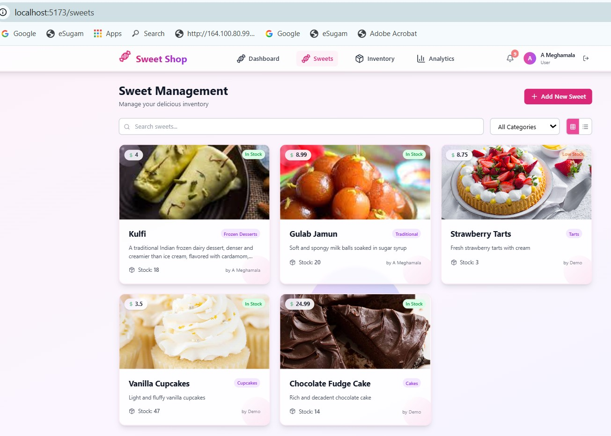
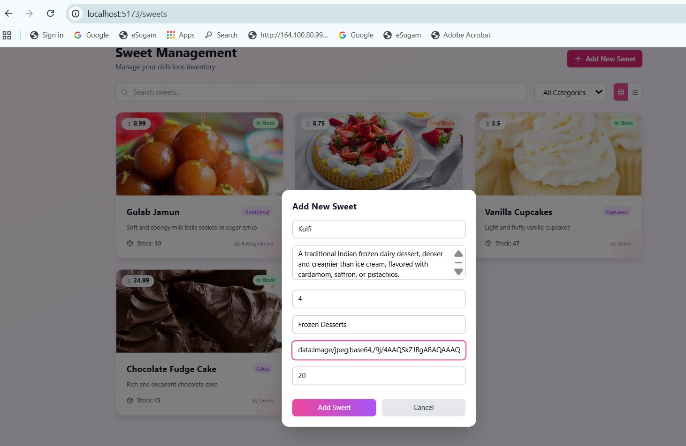
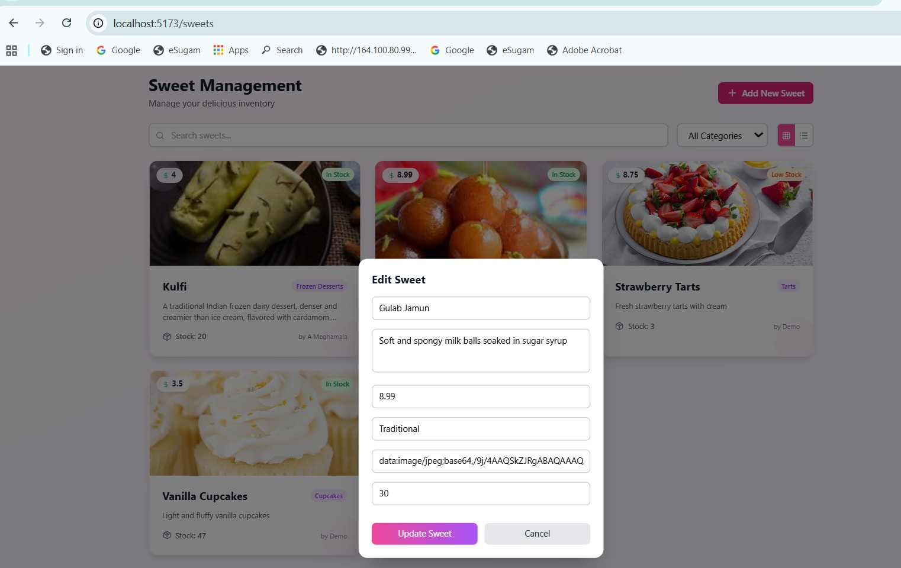
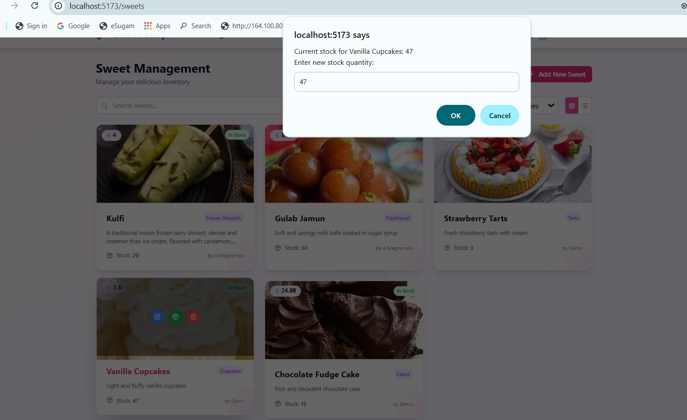
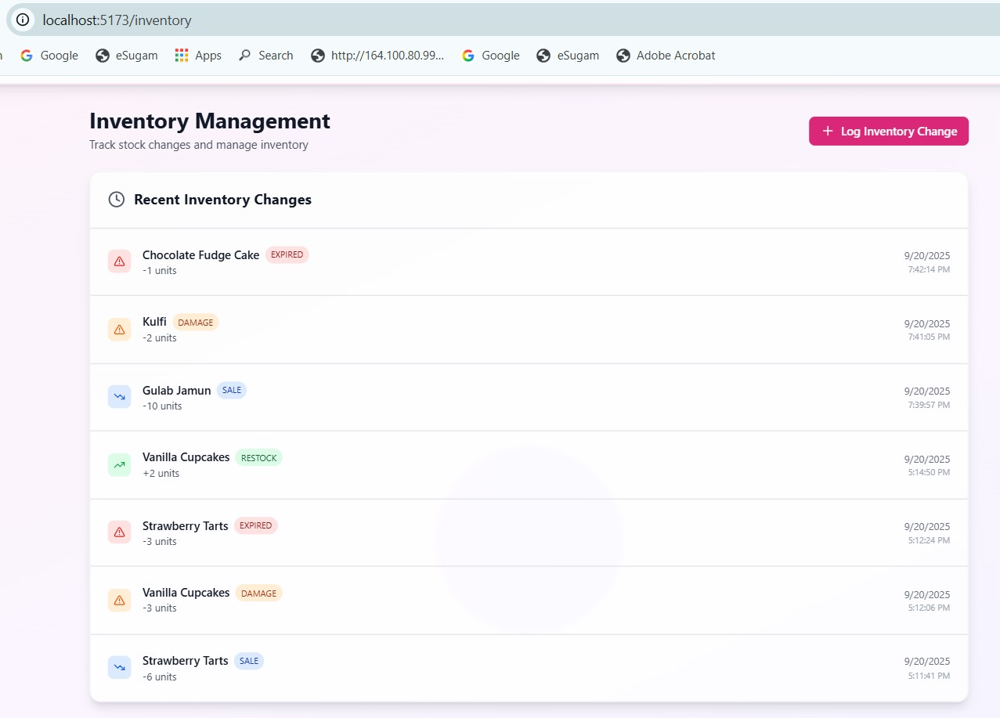
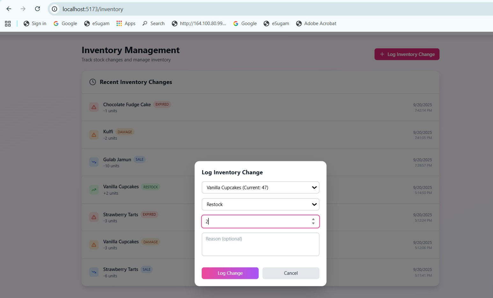
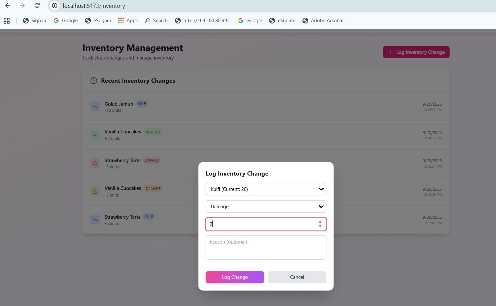
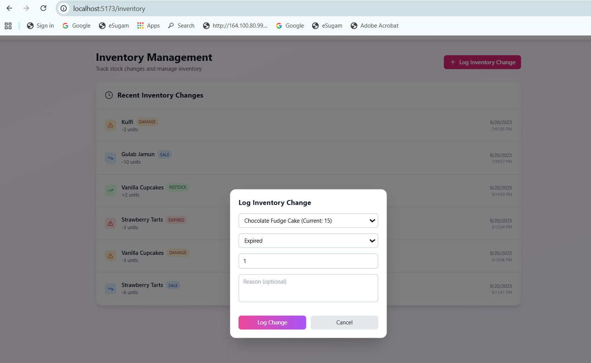
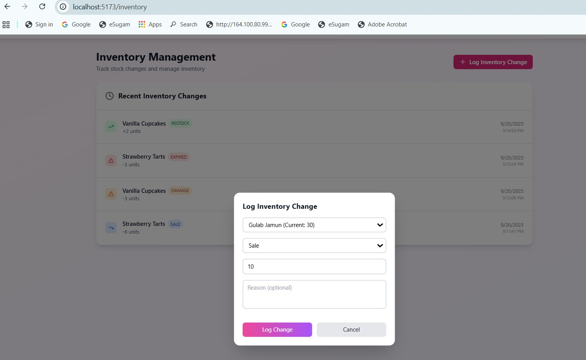
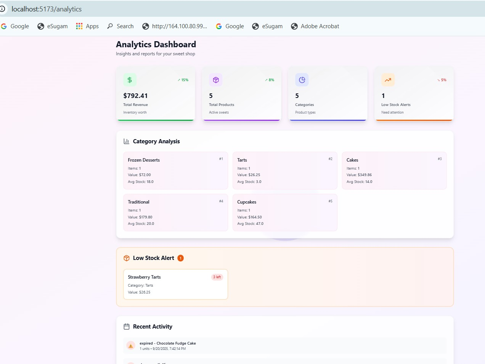

# Sweet Shop Management System

[](LICENSE)

A full-stack web application for managing a sweet shop inventory with real-time features and modern UI.  

## Table of Contents
- [Features](#features)  
- [Tech Stack](#tech-stack)  
- [Setup Instructions](#setup-instructions)  
- [API Endpoints](#api-endpoints)  
- [Test Coverage](#test-coverage)  
- [Screenshots](#screenshots)  
- [My AI Usage](#my-ai-usage)  
- [License](#license)  

---

## Features
- 🔐 Secure authentication system (JWT-based)  
- 🍭 Complete sweet inventory management  
- 📊 Real-time analytics and reporting  
- 🔔 Live notifications system  
- 📱 Responsive design with **glassmorphism UI**  
- 🧪 Comprehensive test coverage (31 tests)  

---

## Tech Stack
- **Frontend**: React, TypeScript, Tailwind CSS  
- **Backend**: Node.js, Express, TypeScript  
- **Database**: PostgreSQL with Prisma ORM  
- **Authentication**: JWT tokens  
- **Testing**: Jest, Supertest  

---

## Setup Instructions

### 1. Clone Repository
```bash
git clone https://github.com/yourusername/sweet-shop-app.git
cd sweet-shop-app

```
### 2. Install Dependencies
# Backend
```bash
cd backend
npm install
```

# Frontend
```bash

cd ../frontend
npm install
 ```

### 3. Setup Database

Install PostgreSQL and create a database.

Update .env with your database credentials.

### 4. Run Migrations
```bash
cd backend
npx prisma migrate dev
```

### 5. Start Servers
# Backend
```bash
npm run dev   # runs on port 3001
```

# Frontend
```bash
cd ../frontend
npm run dev   # runs on port 5173
```

| Endpoint                | Method              | Description             |
| ----------------------- | ------------------- | ----------------------- |
| `/api/auth/register`    | POST                | User registration       |
| `/api/auth/login`       | POST                | User login              |
| `/api/sweets`           | GET/POST/PUT/DELETE | Sweet management (CRUD) |
| `/api/inventory/log`    | POST                | Log inventory changes   |
| `/api/inventory/report` | GET                 | Analytics & reporting   |

### Test Coverage

## Run tests:
```bash
npm test
```

| Feature              | Tests |
|----------------------|-------|
| Authentication       | 7     |
| Sweet Management     | 13    |
| Inventory Management | 11    |
| **Total**            | 31    |

### Screenshots

## Dashboard: Analytics cards with live stats


### Sweet Management: CRUD interface with search/filter


| Feature              | Image |
|----------------------|-------|
| Add Sweet      |     |
| Edit Sweet     |     |
| Stock Update |     |


### Inventory Management: Real-time stock updates


| Feature              | Image |
|----------------------|-------|
| RESTOCK log      |     |
| DAMAGE log     |     |
| EXPIRED log |     |
| SALES log ||


### Analytical Dashboard



### My AI Usage

During the development of this project, I leveraged AI tools to improve workflow efficiency and maintain best practices:

### Tools Used:

#### ChatGPT (OpenAI GPT-5) 
: Assisted in generating structured README content, suggesting TDD Git commit workflows, and explaining complex concepts clearly.

#### Claude AI
: Helped generate boilerplate code for routes, controllers, and React components.

### How I Used AI:

Generated detailed commit messages for Red-Green-Refactor cycles.

Suggested test cases for authentication, sweet management, and inventory modules.

Assisted in designing the frontend layout, including glassmorphism UI effects.

### Reflection:

AI helped save development time and reduce repetitive coding tasks.

It provided guidance for maintaining proper coding standards and consistent TDD practices.

All AI-generated code was reviewed and customized to match my application’s requirements.


### License

This project is licensed under the MIT License. See the LICENSE
 file for details.

